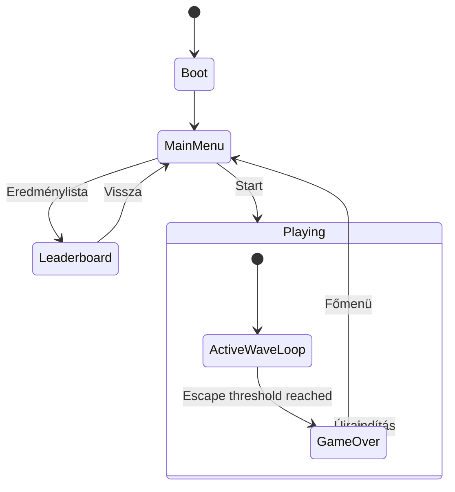
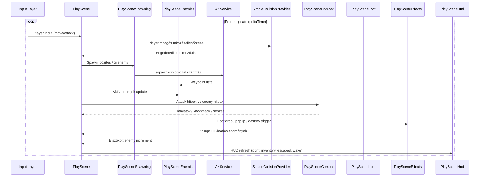
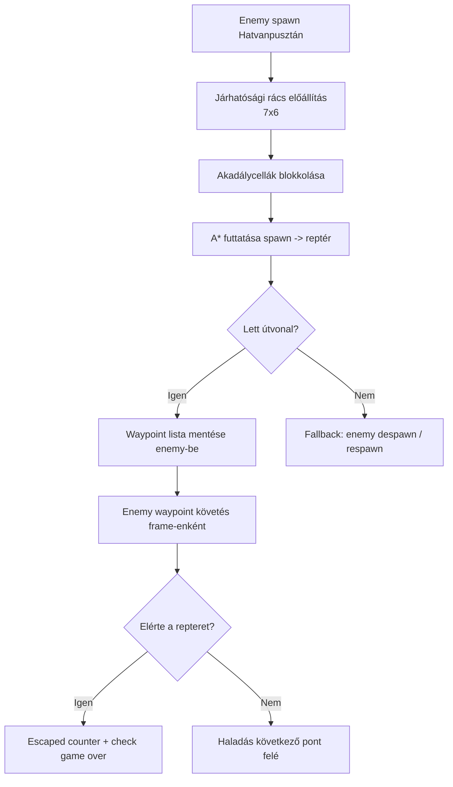
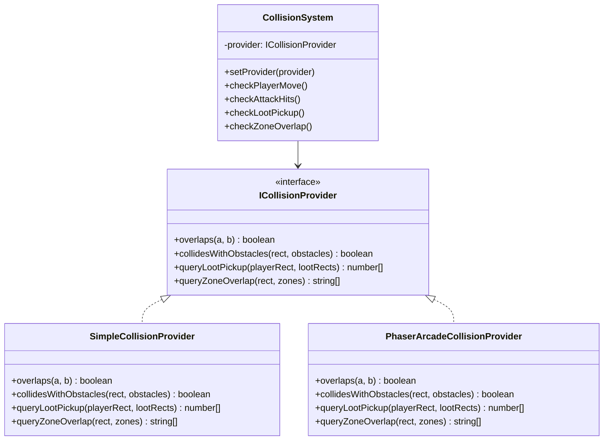
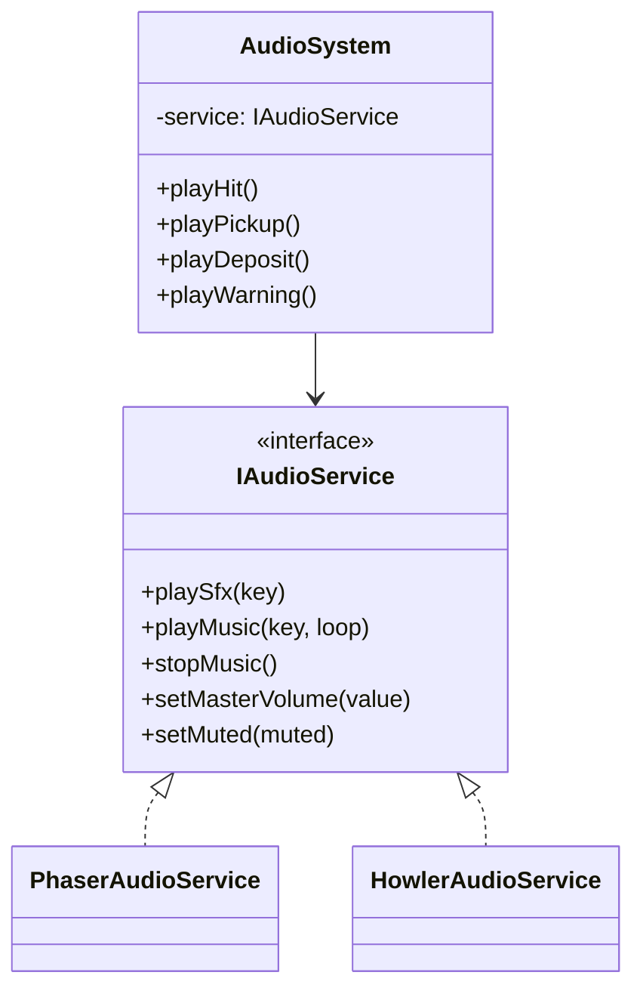
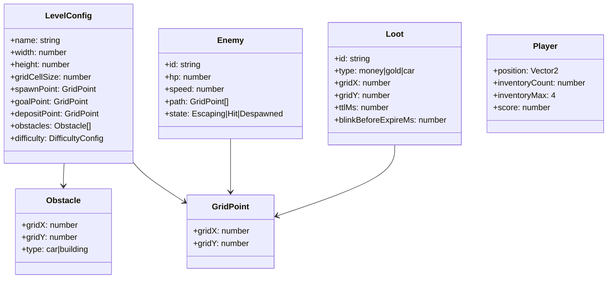
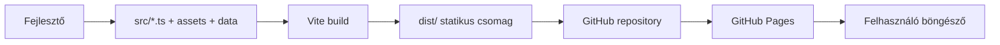

# Heroes of NVVH – Részletes architektúra terv

## 1. Cél és hatókör

Ez a dokumentum a játék implementációs architektúráját rögzíti a már elfogadott döntések alapján.

- Engine: Phaser 3
- Nyelv: TypeScript
- Build: Vite
- Teszt: Vitest
- Pálya: 7×6 logikai rács, trapéz vizuális torzítással
- Pathfinding: saját A*
- Collision: saját, cserélhető szolgáltatásrétegen keresztül
- Audio: Phaser audio, cserélhető wrapper mögött
- Deploy: statikus fájlkiszolgálás (GitHub Pages), backend nélkül

Kapcsolódó döntés ID-k:
- Engine: D-001
- Nyelv: D-002
- Build: D-003
- Teszt: D-004
- Pálya/rács: D-006, D-007, D-008
- Pathfinding: D-013
- Collision: D-014
- Audio: D-016
- Deploy/statikus működés: D-005, D-017, D-018
    subgraph Scenes[Scene réteg]
      Boot[BootScene]
      Menu[MenuScene]
      Play[PlayScene]
      GameOver[GameOverScene]
      Leaderboard[LeaderboardScene]
    end

    subgraph PlaySceneHelpers[PlayScene helper modulok]
      Hud[PlaySceneHud]
      World[PlaySceneWorld]
      Enemies[PlaySceneEnemies]
      Combat[PlaySceneCombat]
      Loot[PlaySceneLoot]
      Player[PlayScenePlayer]
      Hero[PlaySceneHero]
      Spawning[PlaySceneSpawning]
      Effects[PlaySceneEffects]
    end

    subgraph Systems[Gameplay rendszerek]
      GRID[GridSystem]
      PATH[AStarPathfinder]
      COLL[SimpleCollisionProvider]
      AUDIO[AudioSystem]
      LEVEL[LevelLoader]
      ATTACK[AttackSystem]
      LOOTSYS[LootSystem]
    end

    subgraph Data[Adat + Asset]
      Map[level-01.json]
      Sheets[Sprite sheet-ek + textúrák]
      AudioFiles[Audio fájlok]
      LS[LocalStorage]
    end

    Boot --> Sheets
    Boot --> AudioFiles
    Boot --> Map
    Menu --> Play
    Menu --> Leaderboard

    Play --> Hud
    Play --> World
    Play --> Enemies
    Play --> Combat
    Play --> Loot
    Play --> Player
    Play --> Hero
    Play --> Spawning
    Play --> Effects

    Play --> GRID
    Play --> PATH
    Play --> COLL
    Play --> AUDIO
    Play --> LEVEL
    Play --> ATTACK
    Play --> LOOTSYS

    Menu --> AUDIO
    GameOver --> AUDIO
    Leaderboard --> LS
    CM --> CP
    AS --> AP

    GS <--> LS
    SM <--> LS
```

---

## 4. Scene és állapotmodell



---

## 5. Játékmeneti ciklus és update sorrend



---

## 6. Rács + útvonaltervezés (A*)

Kapcsolódó döntés ID-k: **D-007, D-008, D-013**.



---

## 7. Collision architektúra (cserélhetőség)

Kapcsolódó döntés ID: **D-014**.



Megjegyzés:
- MVP-ben `SimpleCollisionProvider` aktív.
- Később provider cserével váltható más implementációra.

---

## 8. Audio architektúra (cserélhetőség)

Kapcsolódó döntés ID: **D-016**.



Megjegyzés:
- MVP-ben `PhaserAudioService` használata.
- `HowlerAudioService` csak későbbi csereopció.

---

## 9. Adatmodell



---

## 10. Build + deployment architektúra

Kapcsolódó döntés ID-k: **D-003, D-005, D-018**.



Működési jellemzők:
- Statikus hosting.
- Nincs aktív backend futásidőben.
- Nincs service worker/PWA réteg.

---

## 11. Nem-funkcionális követelmények

- Célzott platform: desktop böngésző.
- Stabil 60 FPS cél (MVP-ben legalább folyamatos játékélmény).
- Alacsony input késleltetés.
- Egyszerű, jól olvasható HUD.
- Determinisztikus rácslogika enemy pathing és loot/akadály kezeléshez.

---

## 12. MVP implementációs sorrend

1. Projekt bootstrap (`Phaser + TS + Vite`).
2. Scene keret: Boot / Menu / Play / GameOver / Leaderboard.
3. Pálya és rács betöltés (`level-01.json`).
4. Player mozgás + akadályütközés (`SimpleCollisionProvider`).
5. Enemy spawn + A* + waypoint követés.
6. Attack rendszer + 2 HP-s enemy flow + injured animáció.
7. Loot drop/pickup/TTL + blink.
8. NVVH leadás + pontszám + escaped/game over.
9. Audio wrapper + alap SFX.
10. LocalStorage highscore + polish.

---

## 13. Kockázatok és mitigáció

- Pathfinding edge case (nincs útvonal): fallback despawn/respawn stratégia.
- Collision false positive: hitbox méretek központosított konfigurálása.
- Asset memóriahasználat: atlas méret és frame szám limitálása.
- Diagram és implementáció eltérés: döntési napló + architektúra dokumentum együtt frissítendő.

---

## 14. Kapcsolódó dokumentumok

- [docs/Decisions.md](docs/Decisions.md)
- [docs/Tech.md](docs/Tech.md)
- [docs/JatekLeiras.md](docs/JatekLeiras.md)
- [docs/Vizualitas.md](docs/Vizualitas.md)
